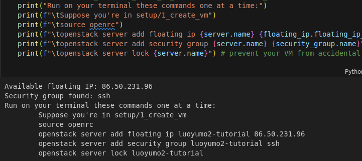
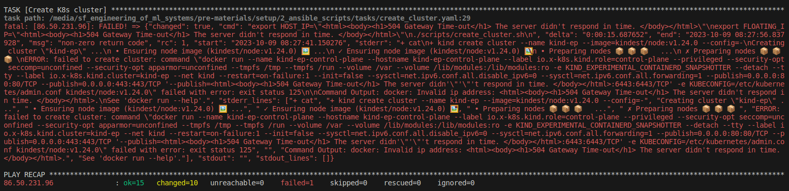
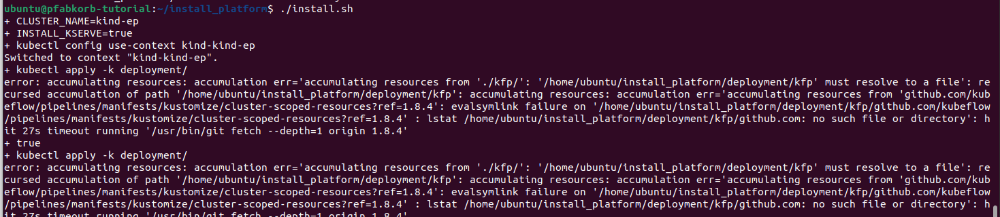

# Common Q&A

## Creating a virtual machine from the provided OVA file
1. I'm using Mac M1 and can't import the OVA file -> You will need to create a virtual machine from scratch using the Ubuntu 22.04 image. See the instructions [here](./building_local_vm.md). Alternatively, you can do the setup locally (i.e., in your host system) by following [this instructions](./preparation_without_vm.md).

1. I get error code "NS_ERROR_INVALID_ARG (0x8007057)" when importing the OVA file -> Please check the following things: 
- Is your downloaded OVA file complete? A complete ova file should be ~14.4GB.
- Do you have enough disk space to host the virtual machine? You need ~35GB disk space to accommodate the VM. 

## Using virtual machines created from the provided OVA file
1. When using the VM in VirtualBox, sometimes I see a reminder of installing some software updates. <br />
You can just ignore th reminder. 

1. My keyboard has a different layout than Finnish keyboard, how can I use an alternative keyboard layout in the VM? <br />
You can follow the instructions in [this article](https://help.ubuntu.com/stable/ubuntu-help/keyboard-layouts.html.en) to configure your keyboard. 

1. I see a warning of a low disk space in the root filesystem. <br />
The VM is assigned ~80GB disk space so there should be enough disk space and this warning is unlikely to appear. If you do see this warning, we recommend first checking if you have anything that occupies a large disk space. If you do need to increase the disk space of your VM, you can follow the instructions in [this blog](https://blog.surges.eu/virtualbox-how-to-solve-the-issue-with-low-disk-space/).

## Setting up the MLOps platform in cPouta
#### Possible errors when doing SSH to a virtual machine in cPouta
1. Permission denied (publickey): 
    1. Mismatch between public and private key. Use `ssh-keygen -y -e -f ~/.ssh/<private_key_file>` to check if the generated public key is the same as the public key saved in cPouta. If not, (unlock and) delete the VM and the public key in cPouta, and delete the private key locally, then rerun openstack.ipynb. 
    1. If the public and private do match each other, try to remove unrelated files from `~/.ssh`, there should be only your private key file(s), `known_hosts` and possibly `known_hosts.old`. 
2. Connection timed out when doing ssh/running the Ansible scripts: 
    1. Did you add your self to the "ssh" security group? In other words, did you run those "openstack server..." commands output by the following code cell?
    
    1. If you recreate a VM in cPouta, the floating IP may change => Are you using the correct floating IP?
3. Too many authentication failures: Use `-o IdentitiesOnly=yes` in the ssh command. (If you have many private keys in ~/.ssh, SSH will try each of them by default. Using "-o IdentitiesOnly=yes" to instruct ssh to only use the file specified in the command). 
---
### Running Ansible scripts
#### Issue 1
The Ansible scripts failed to create a K8s cluster in my cPouta VM. What should I do? <br />
Though not very likely, sometimes you see the following error when running the Ansible scripts:

In this case, you need to first shell into your cPouta VM by running
```bash
ssh -i /home/user/.ssh/<ssh_private_key_file> ubuntu@<floating_ip>
```
Then delete the broken K8s cluster (run this command in your cPouta VM):
```bash
kind delete cluster --name kind-ep
```
Finally, go back to your local environment and run the following command:
```bash
ansible-playbook -i inventory.ini playbook.yaml --extra-vars '{"install_tools":false,"copy_files":false}'
```
This command will ask Ansible to skip the tasks of installing required software and copying necessary files and directly start from the task of creating a K8s cluster in your cPouta VM. 

### Running ./install.sh in cPouta VM
#### Issue 1

You can try one of the following two approaches: 

1. Run `./install.sh` after some time, e.g., 1 hour; 
1. In your cPouta VM, add "https://" to the beginning of the last two links in `~/install_platform/deployment/kfp/kustomization.yaml` yaml, then rerun `./install.sh`.
```text
- https://github.com/kubeflow/pipelines/manifests/kustomize/cluster-scoped-resources?ref=1.8.4
- https://github.com/kubeflow/pipelines/manifests/kustomize/env/platform-agnostic?ref=1.8.4
``` 
(If the previous approach doesn't help, also add "?timeout=90s" to the end of the links.)

---

#### Issue 2
I got the 'Internal error occurred: failed calling webhook "webhook.cert-manager.io"' error when running `./install.sh` in my cPouta VM. 
```text
Error from server (InternalError): error when creating "https://github.com/kserve/kserve/releases/download/v0.10.1/kserve.yaml": Internal error occurred: failed calling webhook "webhook.cert-manager.io": failed to call webhook: Post "https://cert-manager-webhook.cert-manager.svc:443/mutate?timeout=10s": x509: certificate signed by unknown authority
```
Simply rerun `./install.sh`

---

### After setting up the MLOps platform
I can't access http://mlflow-server.local: Check if your `/etc/hosts`
have the following lines,
```
FLOATING_IP kserve-gateway.local
FLOATING_IP ml-pipeline-ui.local
FLOATING_IP mlflow-server.local
FLOATING_IP mlflow-minio-ui.local
FLOATING_IP mlflow-minio.local
FLOATING_IP prometheus-server.local
FLOATING_IP grafana-server.local
```
where FLOATING_IP should be the floating IP of your cPouta VM. 


