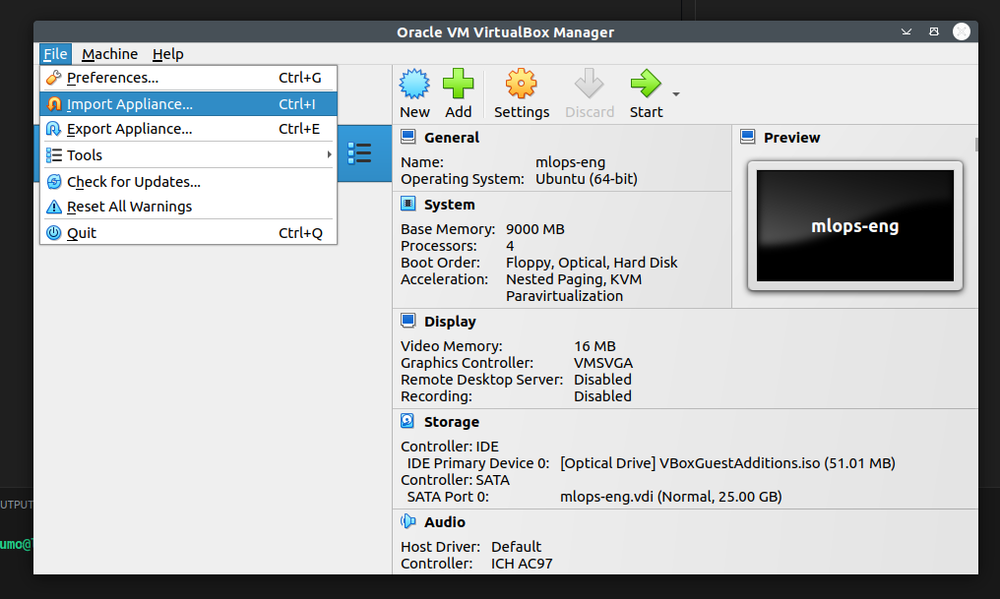
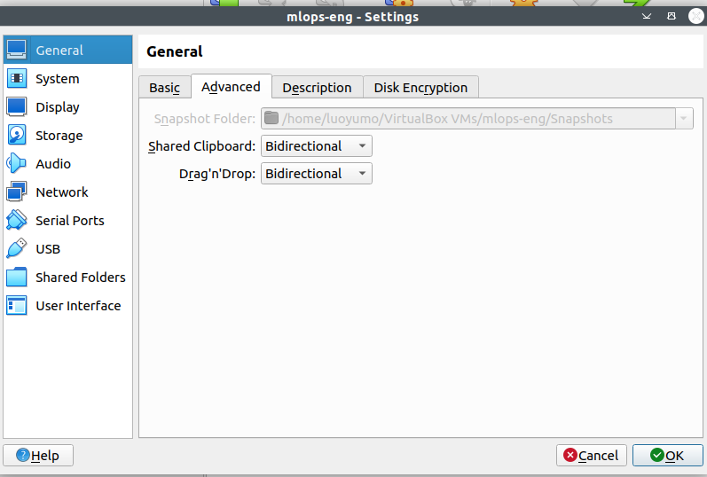
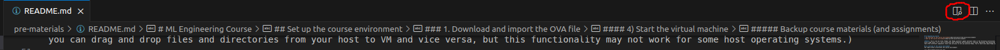

# Create a Ubuntu VM as the local environment

We provide a Ubuntu 22.04 LTS OVA file which can be imported as a virtual machine (VM) so that you can use the VM as your local environment. 

### 1. Download and import the OVA file
#### 1) Download VirtualBox
VirtualBox can be downloaded from [the official website](https://www.virtualbox.org/wiki/Downloads). Version 7 is recommended.

#### 2) Download the OVA file
The OVA file can be downloaded [here]().

#### 3) Import the OVA file in VirtualBox
1. Open VirtualBox
2. Click File -> Import Appliance



3. Select the downloaded OVA file, click Next -> Finish

#### 4) Start the virtual machine
After importing the OVA file, you will see a VM created. 

Let's first enable bidirectional shared clipboard so you can copy/paste text from your host to VM (and vice versa). You can do this by going to VirtualBox Manager control panel -> clicking Settings -> General -> Advanced -> setting Shared Clipboard to bidirectional. (You can also set Drag'n'Drop to bidirectional so you can drag and drop files and directories from your host to VM and vice versa, but this functionality may not work for some host operating systems.)



#### 5) Log in to the virtual machine
Now, you can log in to your VM. The username is "**user**" and the password for login and admin privilege is "**password**". 

*Note*: the default keyboard layout of the VM is Finnish, you can configure the keyboard layouts following [this article](https://help.ubuntu.com/stable/ubuntu-help/keyboard-layouts.html.en).

#### 6) Download the course repository
---

In your VM, open a terminal (ctrl+alt+t) and run the following command to download the course repository:
```bash
git clone https://version.helsinki.fi/luoyumo/engineering_of_ml_systems.git`. 
# You will be asked to enter a username and password, these are your university credentials. 
```

Switch to the correct Python environment:
```bash
conda activate mlops_eng
```

And go to the `engineering_of_ml_systems/pre-materials` directory:
```bash
cd <path_to_engineering_of_ml_systems>/pre-materials
```
You can use Visual Studio Code (VS Code) to open the directory:
```bash
# Under the pre-materials repository
code .
```
Open the `README.md` and you'll see the same instructions. You can open a preview of a Markdown file by clicking the button shown below in the upper-right corner.



---

#### Backup course materials (Optional)
It's a good practice a back up the course materials you'll be working on so you won't loss them (especially your work-in-progress assignments) when your VM crashes. Note that your modifications on the files in your VM won't be synchronized to your host so you need to take care of the backup, e.g., using GitHub or some other cloud services like OneDrive or Google Drive. Alternatively, you can also back up the whole virtual machine by creating an OVA file for it, as shown in this [video](https://www.youtube.com/watch?v=9qSTS-RgOA0).

---

After finishing the preparation, continue with the "2. Create a VM in cPouta" section in the [main instructions](../README.md#2-create-a-vm-in-cpouta). 

